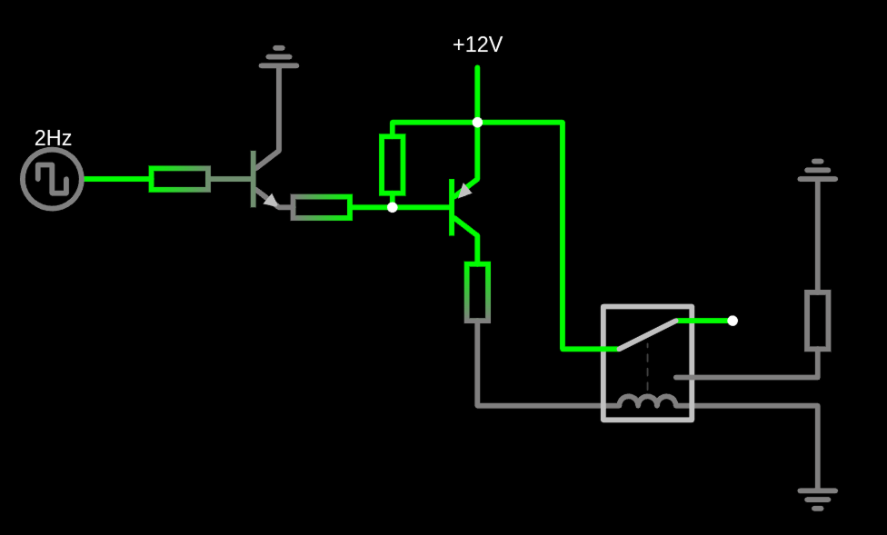

# TMC
An STM32 project for controlling an external heating element via PWM

# The operating principle
The operating principle: a microcontroller with an enabled PWM generator is connected to a circuit with a transistor bundle, which, via a PWM signal, controls the opening and closing of an electromagnetic relay, which, in turn, shunts a current with a voltage of 12 volts to heat a heating element, which is heated, again, by opening and closing the relay (the explanation is a bit confusing)

# The MCU's firmware operating principle
The user sends commands to the microprocessor via the COM port. The microprocessor receives these commands and performs actions based on them: these can range from changing the temperature mode to displaying debug information about the device, etc.

After sending a command to set a specific temperature level, the microprocessor changes the PWM frequency until the heating element reaches the requested temperature. To obtain information about the heating element's temperature, the microprocessor also works with a temperature sensor. When the heating element reaches the requested temperature, a software PID controller is automatically activated, which automatically adjusts the heating element's temperature to the set point (to prevent temperature fluctuations and drift)